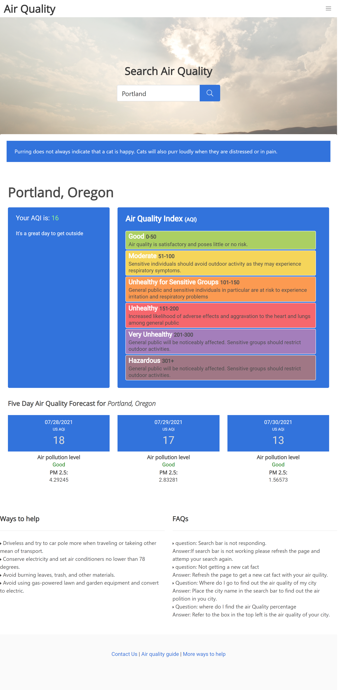

# Air Quality Index App

This website/app provides you with your searched AQI (Air Quality Index) for the given location.

## Features

- Search by city and get that locations AQI and/or you will recieve the AQI for a neighboring city based on it's coordinates.
- Link to the fire map website.
- Link to AQI Cam website.
- A random cat fact to brighten your day.
- Forecast AQI for that area.
- AQI Number changes according to its severity.
- Chart with AQI levels and their corresponding risk.
- Ways to help section.

## Future Updates
- Better catch of user inputed data in the search bar.
- Button to create a new random cat fact!

## Team Members and Contributers
- [Tyler Roll](https://github.com/tyler1836)
- [McKinley Jones](https://github.com/jonestechnics)
- [Mark Berrett](https://github.com/berrett1011)
- [Brandon Stewart](https://github.com/brandon-stewart-rgb)
- [Victor L Perez](https://github.com/Zunaty)

## References / APIs
- [Air Visual API](https://www.iqair.com/us/air-pollution-data-api)
- [Position Stack API](https://positionstack.com/)
- [Weatherbit API](https://www.weatherbit.io/api)
- [Cat Fact API](https://cat-fact.herokuapp.com/#/)
- [AQI Guide](https://www.airnow.gov/publications/activity-guides/air-quality-guide-for-particle-pollution/)
- [Actions to Reduce AQI](https://www3.epa.gov/region1/airquality/reducepollution.html)

## Link to Website
[GitHub Page](https://zunaty.github.io/air-quality)

## Preview of website
